[](https://central.sonatype.com/artifact/io.github.mflisar.composedialogs/core)   
# ComposeDialogs
    

This library offers you an easily extendible compose framework for modal dialogs and allows to show them as a **dialog**, **bottom sheet** or even as **full screen dialog**.

> [!NOTE]
> All features are splitted into separate modules, just include the modules you want to use!

# Table of Contents

- [Screenshots](#camera-screenshots)
- [Supported Platforms](#computer-supported-platforms)
- [Versions](#arrow_right-versions)
- [Setup](#wrench-setup)
- [Usage](#rocket-usage)
- [Modules](#file_folder-modules)
- [Demo](#sparkles-demo)
- [More](#information_source-more)
- [API](#books-api)
- [Other Libraries](#bulb-other-libraries)

# :camera: Screenshots

### color

|  |  |  |
|---|---|---|
| 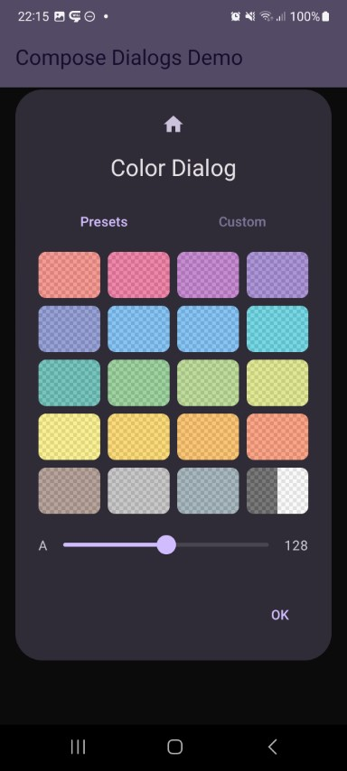 | 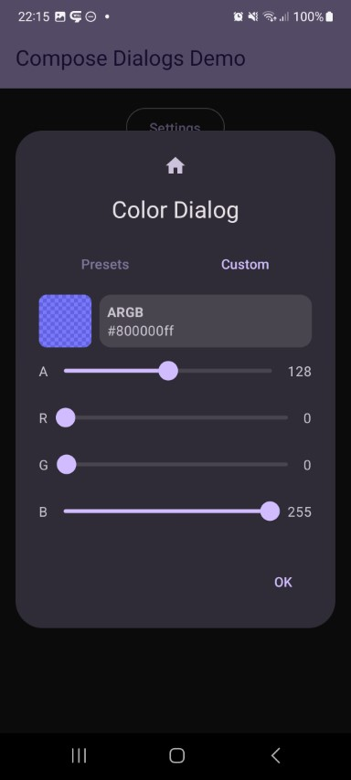 | 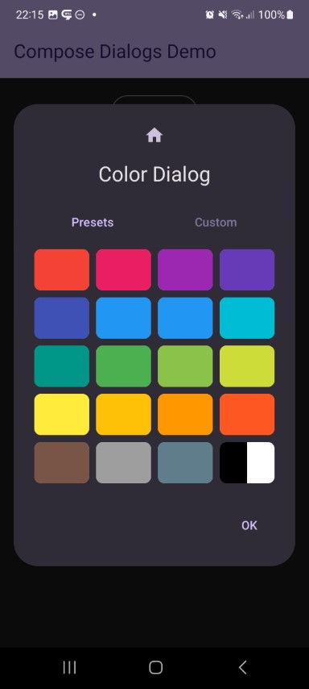 |
| 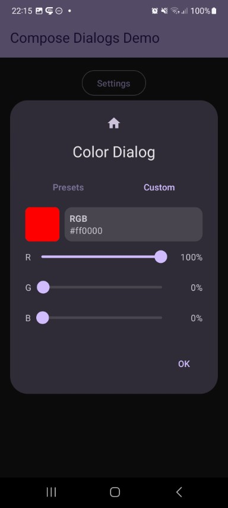 |

### date

|  |  |  |
|---|---|---|
| 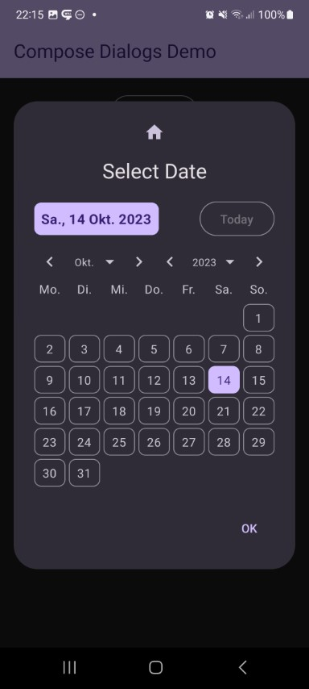 |  | 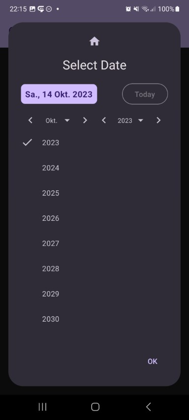 |

### frequency

|  |  |  |
|---|---|---|
| 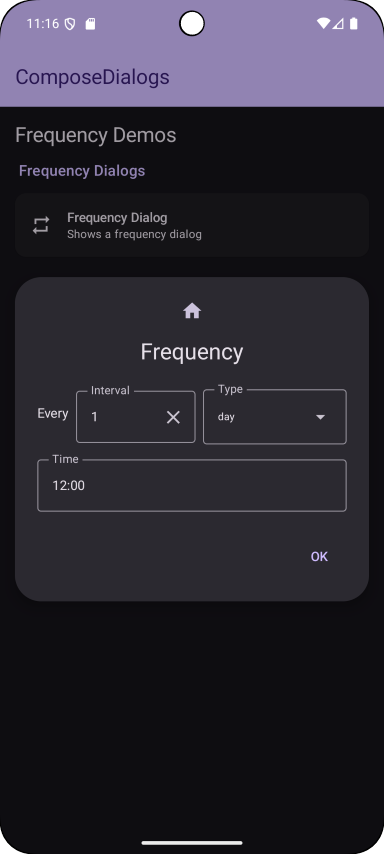 | 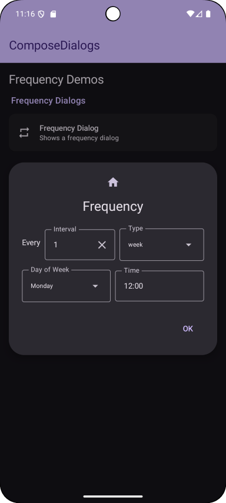 | 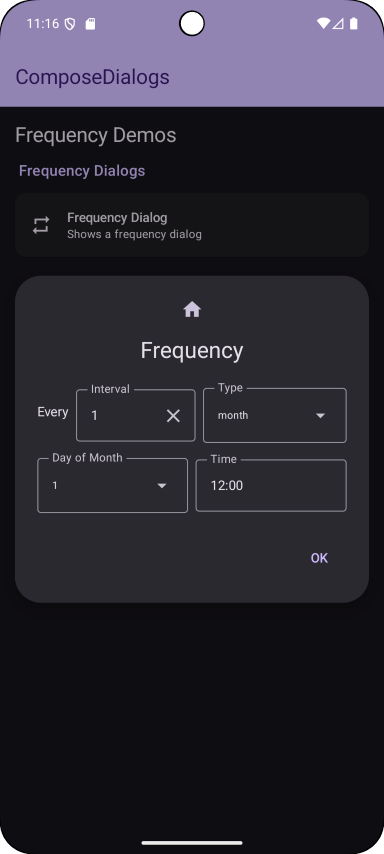 |
| 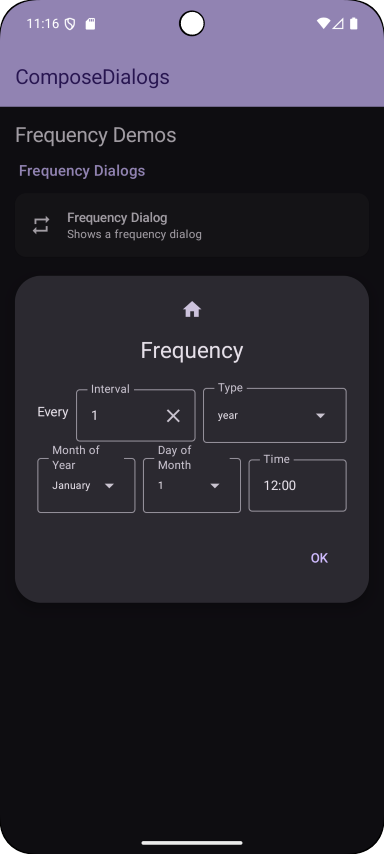 |

### info

|  |  |  |
|---|---|---|
| 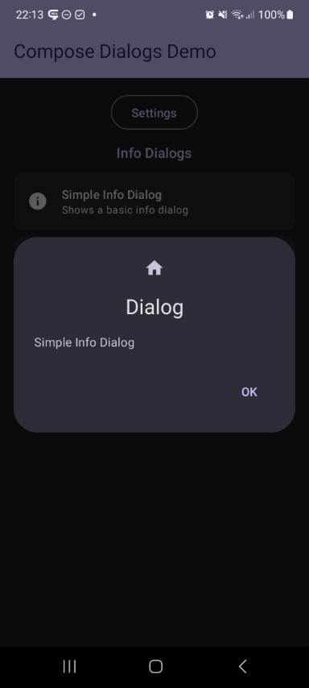 | 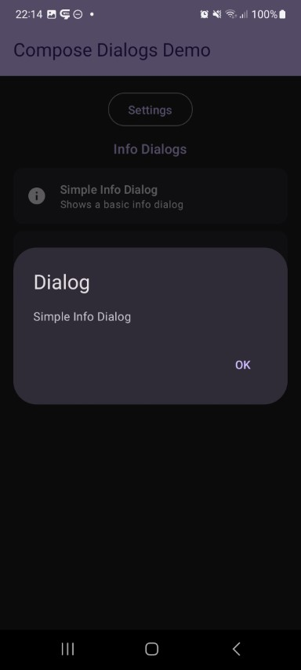 | 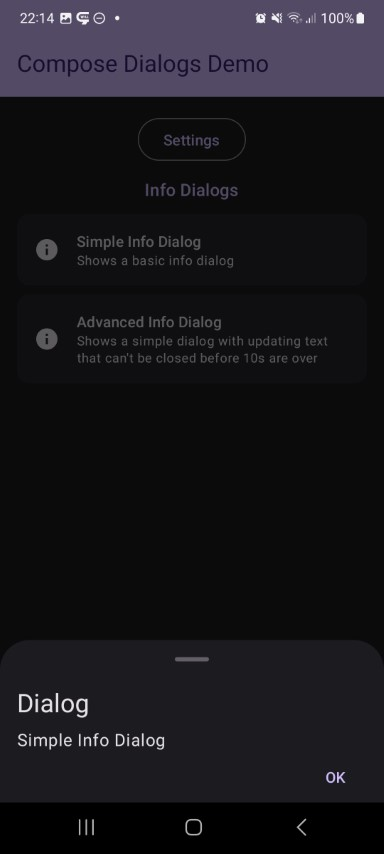 |
| 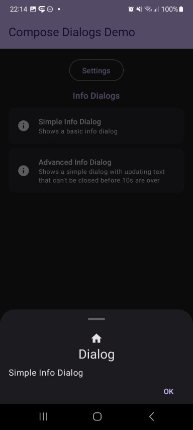 |

### input

|  |  |  |
|---|---|---|
| 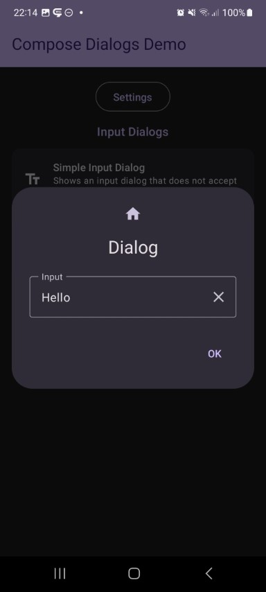 |  |

### list

|  |  |  |
|---|---|---|
| 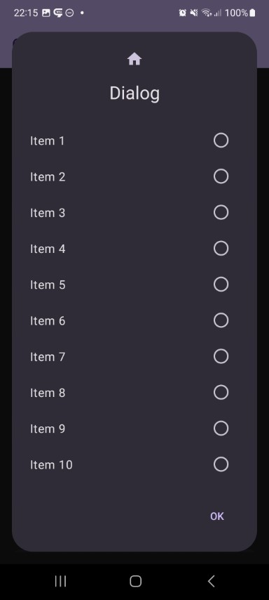 | 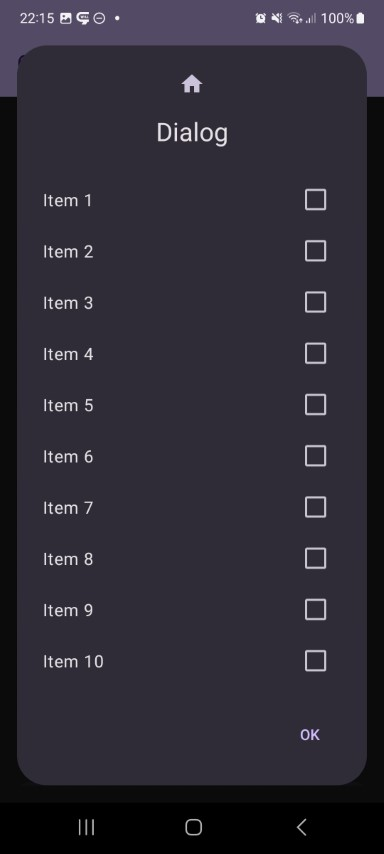 | 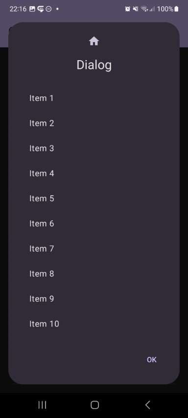 |
| 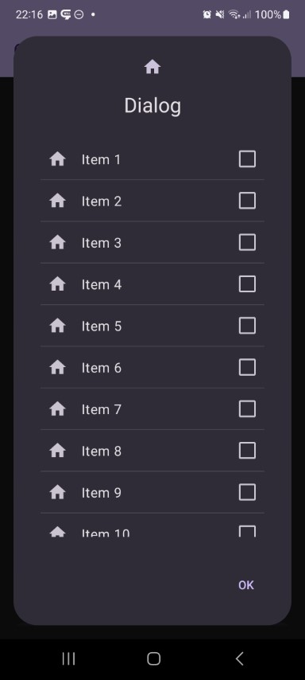 | 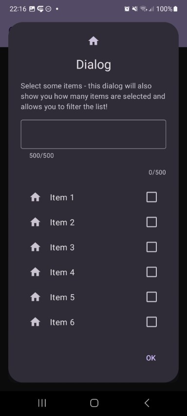 | 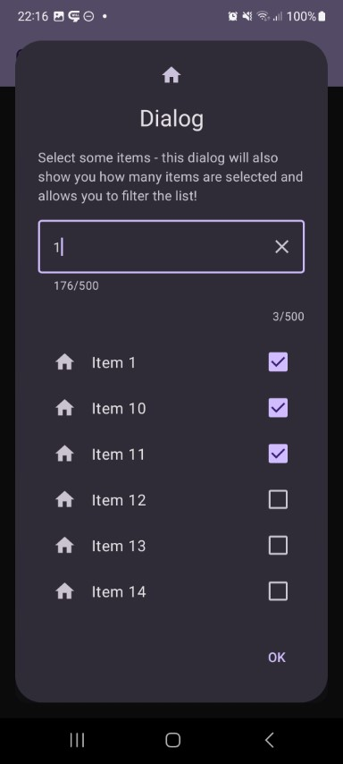 |
| 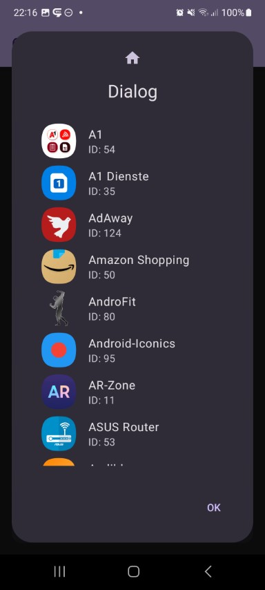 |

### menu

|  |  |  |
|---|---|---|
| 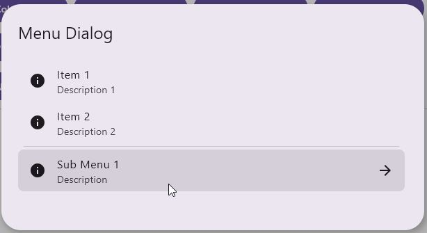 |

### number

|  |  |  |
|---|---|---|
| 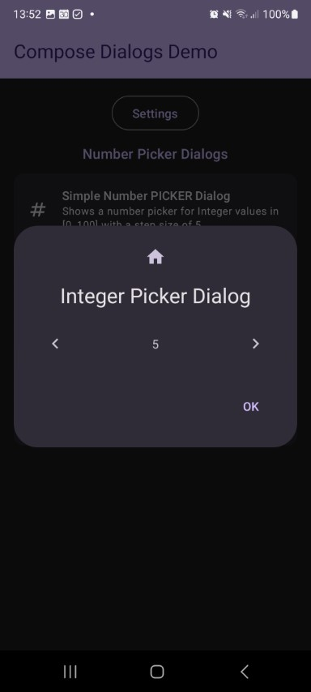 | 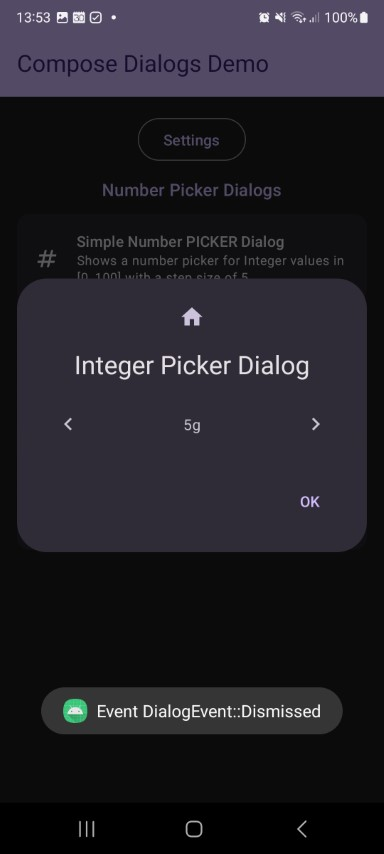 | 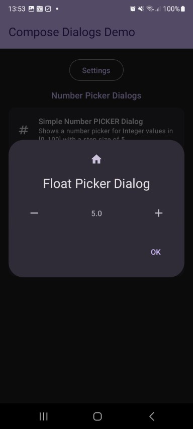 |

### progress

|  |  |  |
|---|---|---|
| 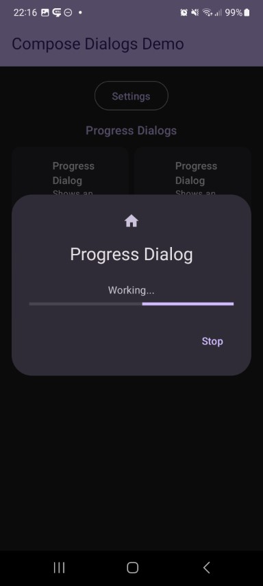 | 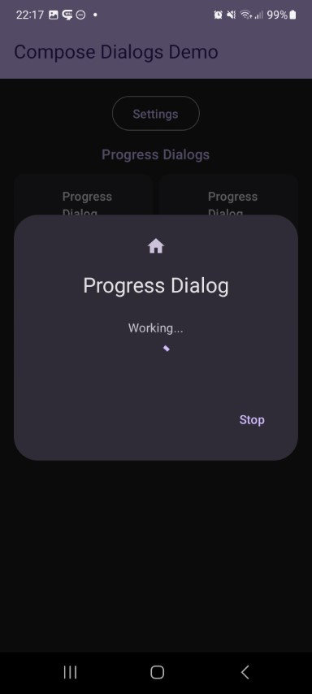 |

### time

|  |  |  |
|---|---|---|
| 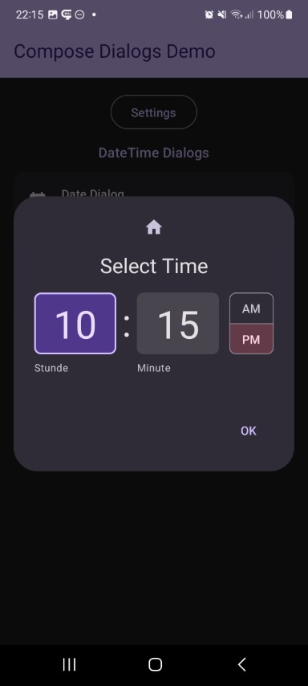 | 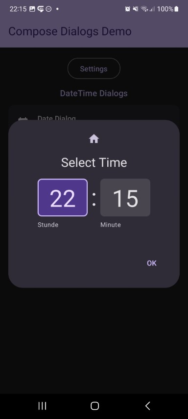 |

# :computer: Supported Platforms

| Module | android | iOS | windows | wasm |
|---|---|---|---|---|
| core | ✅ | ✅ | ✅ | ✅ |
| dialog-color | ✅ | ✅ | ✅ | ✅ |
| dialog-date | ✅ | ✅ | ✅ | ✅ |
| dialog-info | ✅ | ✅ | ✅ | ✅ |
| dialog-input | ✅ | ✅ | ✅ | ✅ |
| dialog-list | ✅ | ✅ | ✅ | ✅ |
| dialog-menu | ✅ | ✅ | ✅ | ✅ |
| dialog-number | ✅ | ✅ | ✅ | ✅ |
| dialog-progress | ✅ | ✅ | ✅ | ✅ |
| dialog-time | ✅ | ✅ | ✅ | ✅ |
| dialog-frequency | ✅ | ✅ | ✅ | ✅ |

# :arrow_right: Versions

| Dependency | Version |
|---|---|
| Kotlin | `2.3.20` |
| Jetbrains Compose | `1.10.3` |
| Jetbrains Compose Material3 | `1.9.0` |

> :warning: Following experimental annotations are used:
> - **OptIn**
>   - `androidx.compose.material3.ExperimentalMaterial3Api` (3x)
>   - `androidx.compose.ui.ExperimentalComposeUiApi` (3x)
>
> I try to use as less experimental features as possible, but in this case the ones above are needed!

# :wrench: Setup

<details open>

<summary><b>Using Version Catalogs</b></summary>

<br>

Define the dependencies inside your **libs.versions.toml** file.

```toml
[versions]

composedialogs = "<LATEST-VERSION>"

[libraries]

composedialogs-core = { module = "io.github.mflisar.composedialogs:core", version.ref = "composedialogs" }
composedialogs-dialog-color = { module = "io.github.mflisar.composedialogs:dialog-color", version.ref = "composedialogs" }
composedialogs-dialog-date = { module = "io.github.mflisar.composedialogs:dialog-date", version.ref = "composedialogs" }
composedialogs-dialog-info = { module = "io.github.mflisar.composedialogs:dialog-info", version.ref = "composedialogs" }
composedialogs-dialog-input = { module = "io.github.mflisar.composedialogs:dialog-input", version.ref = "composedialogs" }
composedialogs-dialog-list = { module = "io.github.mflisar.composedialogs:dialog-list", version.ref = "composedialogs" }
composedialogs-dialog-menu = { module = "io.github.mflisar.composedialogs:dialog-menu", version.ref = "composedialogs" }
composedialogs-dialog-number = { module = "io.github.mflisar.composedialogs:dialog-number", version.ref = "composedialogs" }
composedialogs-dialog-progress = { module = "io.github.mflisar.composedialogs:dialog-progress", version.ref = "composedialogs" }
composedialogs-dialog-time = { module = "io.github.mflisar.composedialogs:dialog-time", version.ref = "composedialogs" }
composedialogs-dialog-frequency = { module = "io.github.mflisar.composedialogs:dialog-frequency", version.ref = "composedialogs" }
```

And then use the definitions in your projects **build.gradle.kts** file like following:

```java
implementation(libs.composedialogs.core)
implementation(libs.composedialogs.dialog.color)
implementation(libs.composedialogs.dialog.date)
implementation(libs.composedialogs.dialog.info)
implementation(libs.composedialogs.dialog.input)
implementation(libs.composedialogs.dialog.list)
implementation(libs.composedialogs.dialog.menu)
implementation(libs.composedialogs.dialog.number)
implementation(libs.composedialogs.dialog.progress)
implementation(libs.composedialogs.dialog.time)
implementation(libs.composedialogs.dialog.frequency)
```

</details>

<details>

<summary><b>Direct Dependency Notation</b></summary>

<br>

Simply add the dependencies inside your **build.gradle.kts** file.

```kotlin
val composedialogs = "<LATEST-VERSION>"

implementation("io.github.mflisar.composedialogs:core:${composedialogs}")
implementation("io.github.mflisar.composedialogs:dialog-color:${composedialogs}")
implementation("io.github.mflisar.composedialogs:dialog-date:${composedialogs}")
implementation("io.github.mflisar.composedialogs:dialog-info:${composedialogs}")
implementation("io.github.mflisar.composedialogs:dialog-input:${composedialogs}")
implementation("io.github.mflisar.composedialogs:dialog-list:${composedialogs}")
implementation("io.github.mflisar.composedialogs:dialog-menu:${composedialogs}")
implementation("io.github.mflisar.composedialogs:dialog-number:${composedialogs}")
implementation("io.github.mflisar.composedialogs:dialog-progress:${composedialogs}")
implementation("io.github.mflisar.composedialogs:dialog-time:${composedialogs}")
implementation("io.github.mflisar.composedialogs:dialog-frequency:${composedialogs}")
```

</details>

# :rocket: Usage

#### Basic examples

```kotlin
// create and remember a state
val state = rememberDialogState()

// Create a dialog composable
if (state.visible) {
    DialogInfo(
        state = state,
        info = "Some "
    )
}

// show the dialog inside a button press event or similar
Button(onClick = { state.show() }) {
    Text("Show Dialog")
}
```

Alternatively you can hold any `saveable` state inside dialog state. If the dialog state holds any data, it will consider itself as visible.

```kotlin
// create and remember a state (e.g. selected list index as in this example)
val state = rememberDialogState<Int>(data = null)

// show a dialog if necessary
if (state.showing)
{
    val data = state.requireData() // in this example the data is the list index
    DialogInfo(
        state = state,
        info = "Data = $data"
    )
}

// a list that uses the dialog
val items = 1..100
LazyColumn {
    items.forEach {
        item(key = it) {
            Button(onClick = { state.show(it) }) {
                Text("Item $it")
            }
        }
    }
}
```

#### Styling/Customisation and events

All dialog (also custom ones) do support styling like:

* optional icon (including style like `CenterTop` and `Begin`)
* dialog style (dialog, bottom sheet, fullscreen)
* custom buttons (zero, one or two) with custom texts
* a options variable to set up features like `dismissOnButtonClick`, `dismissOnBackPress` and `dismissOnClickOutside`
* an event callback for the close event and button click event

Check out the advanced region on the side for more details.

#### Dialogs

Check out all the modules to find out more about the available implementations.

# :file_folder: Modules

- [core](documentation/Modules/core.md)
- [dialog-color](documentation/Modules/dialog-color.md)
- [dialog-date](documentation/Modules/dialog-date.md)
- [dialog-frequency](documentation/Modules/dialog-frequency.md)
- [dialog-info](documentation/Modules/dialog-info.md)
- [dialog-input](documentation/Modules/dialog-input.md)
- [dialog-list](documentation/Modules/dialog-list.md)
- [dialog-menu](documentation/Modules/dialog-menu.md)
- [dialog-number](documentation/Modules/dialog-number.md)
- [dialog-progress](documentation/Modules/dialog-progress.md)
- [dialog-time](documentation/Modules/dialog-time.md)

# :sparkles: Demo

A full [demo](/demo) is included inside the demo module, it shows nearly every usage with working examples.

# :information_source: More

- Advanced
  - [Buttons](documentation/Advanced/Buttons.md)
  - [Custom Dialog](documentation/Advanced/Custom%20Dialog.md)
  - [Events](documentation/Advanced/Events.md)
  - [Styles](documentation/Advanced/Styles.md)
- Migration
  - [v2](documentation/Migration/v2.md)

# :books: API

Check out the [API documentation](https://MFlisar.github.io/ComposeDialogs/).

# :bulb: Other Libraries

You can find more libraries (all multiplatform) of mine that all do work together nicely [here](https://mflisar.github.io/Libraries/).
