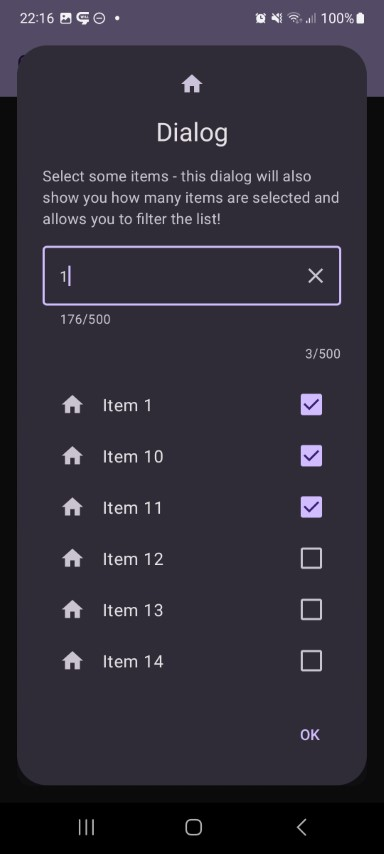
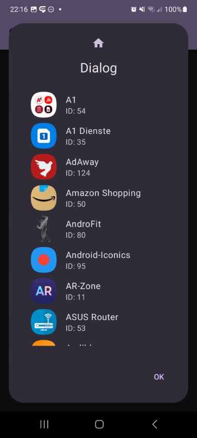

This shows a dialog with a list of items. Rendering, selection mode and more is adjustable.

Check out the composable and it's documentation in the code snipplet below.

Generally following can be adjusted:

* list of items or loading list items asynchronously
* single selection / multi selection / clickable
* optional dividers
* filter and search functionality
* custom items

#### Example

```kotlin
--8<-- "../../demo/desktop/src/jvmMain/kotlin/com/michaelflisar/composedialogs/demo/Main.kt:demo-list"
```

#### Composable

There are 2 ways to show a list, one by providing a list of items and one by providing an asynchronous item loader function.

=== "List"

    ```kotlin
    --8<-- "../../library/modules/list/src/commonMain/kotlin/com/michaelflisar/composedialogs/dialogs/list/DialogList.kt:constructor"
    ```

=== "Loader"

    ```kotlin
    --8<-- "../../library/modules/list/src/commonMain/kotlin/com/michaelflisar/composedialogs/dialogs/list/DialogList.kt:constructor2"
    ```

#### Screenshots

| | | |                                                   |
|-|-|-|---------------------------------------------------|
|  |  |  |  |
|  |  |  |                                                   |