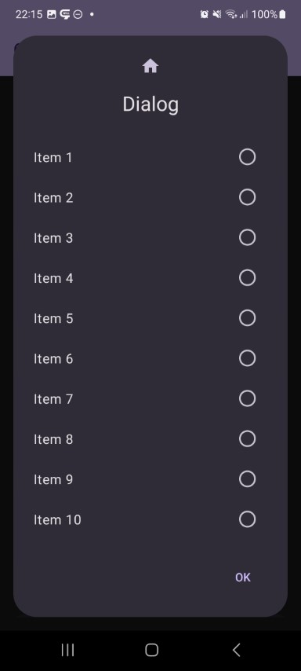
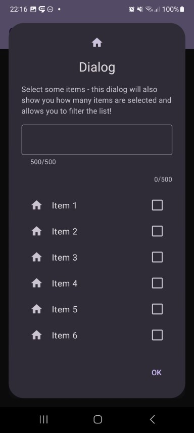

This shows a dialog with a list of items. Rendering, selection mode and more is adjustable.

Check out the composable and it's documentation in the code snipplet below.

Generally following can be adjusted:

* list of items or loading list items asynchronously
* single selection / multi selection / clickable
* optional dividers
* filter and search functionality
* custom items

#### Example

```kotlin
val state = rememberDialogState()
val selected = remember { mutableStateOf<Int?>(null) }
val items = List(100) { "Item $it" }
DialogList(
    style = style,
    title = { Text("List Dialog") },
    icon = getIcon,
    buttons = buttons,
    description = "Some optional description",
    state = state,
    items = items,
    itemIdProvider = { items.indexOf(it) },
    selectionMode = DialogList.SelectionMode.SingleSelect(
        selected = selected,
        selectOnRadioButtonClickOnly = false
    ),
    itemContents = DialogList.ItemDefaultContent(
        text = { it }
    ),
    onEvent = {
        val info = if (it is DialogEvent.Button && it.button == DialogButtonType.Positive) {
            "Selected list value: ${selected.value?.let { "Index = $it | Item = ${items[it]}" }}"
        } else {
            "Event $it"
        }
        // ...
    }
)
```

#### Composable

There are 2 ways to show a list, one by providing a list of items and one by providing an asynchronous item loader function.

=== "List"

    ```kotlin
    --8<-- "../../library/modules/list/src/commonMain/kotlin/com/michaelflisar/composedialogs/dialogs/list/DialogList.kt:constructor"
    ```

=== "Loader"

    ```kotlin
    --8<-- "../../library/modules/list/src/commonMain/kotlin/com/michaelflisar/composedialogs/dialogs/list/DialogList.kt:constructor2"
    ```

#### Screenshots

| | | |                                                   |
|-|-|-|---------------------------------------------------|
|  |  |  |  |
|  |  |  |                                                   |