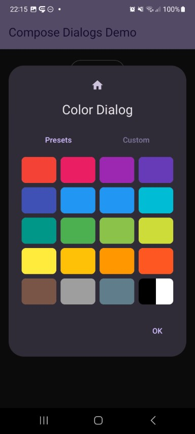
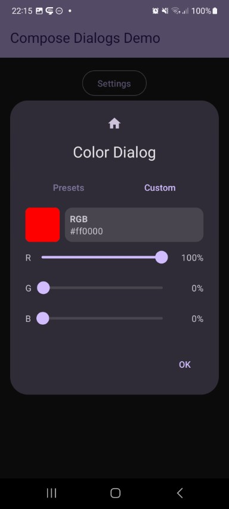

This shows a color selector dialog. A table with predefined material colors as well as a customisation page will be shown. Alpha support can be enabled optionally.

Check out the composable and it's documentation in the code snipplet below.

Generally following can be adjusted:

* alpha support yes/no
* shape of a color composable inside the color grid (rect, rounded rect, circle, ...)
* the number of columns in the color grid
* the style of how RGB(A) values are displayed (either as a number in the range of [0, 255] or as a percentage value [0%, 100%])

#### Composable

```kotlin
--8<-- "../library/modules/color/src/commonMain/kotlin/com/michaelflisar/composedialogs/dialogs/color/DialogColor.kt:46:79"
```

#### Example

```kotlin
--8<-- "../demo/android/src/main/java/com/michaelflisar/composedialogs/demo/demos/ColorDemos.kt:35:52"
```

#### Screenshots

| | | | |
|-|-|-|-|
|  |  |  |  |