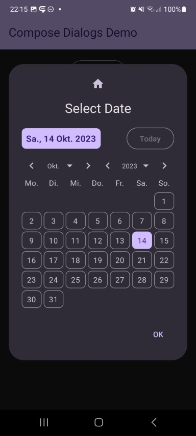
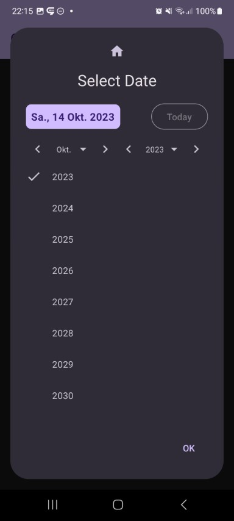

This shows a date selector dialog. First day of week, labels, and style can be adjusted to your needs.

Check out the composable and it's documentation in the code snipplet below.

Generally following can be adjusted:

* custom texts
* custom first day of week
* cel height of the calendar
* optional next/previous month buttons

#### Composable

```kotlin
--8<-- "../library/modules/date/src/commonMain/kotlin/com/michaelflisar/composedialogs/dialogs/date/DialogDate.kt:constructor"
```

#### Example

```kotlin
--8<-- "../demo/android/src/main/java/com/michaelflisar/composedialogs/demo/demos/DateTimeDemos.kt:demo-date"
```

#### Screenshots

| | | |
|-|-|-|
|  |  |  |