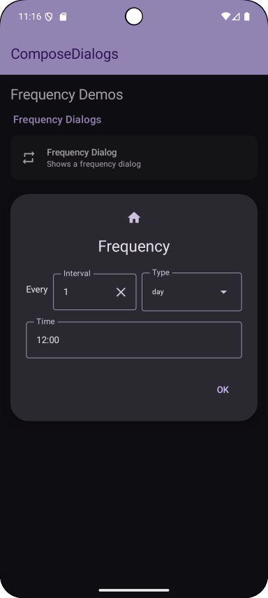
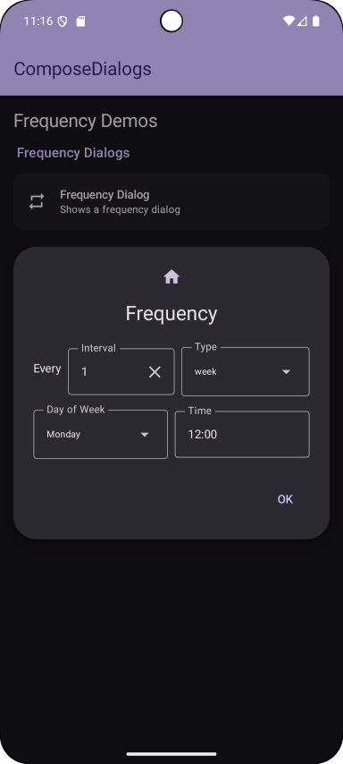
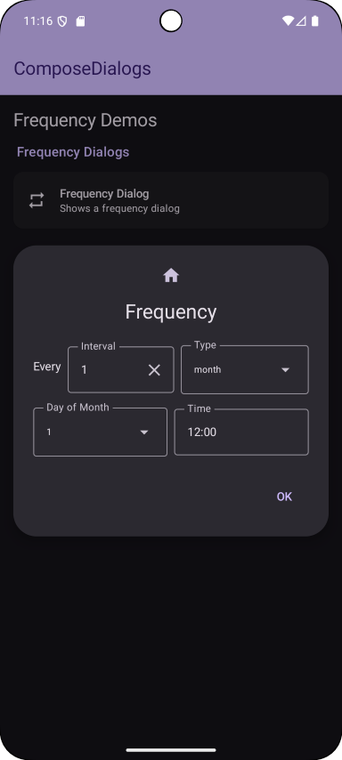
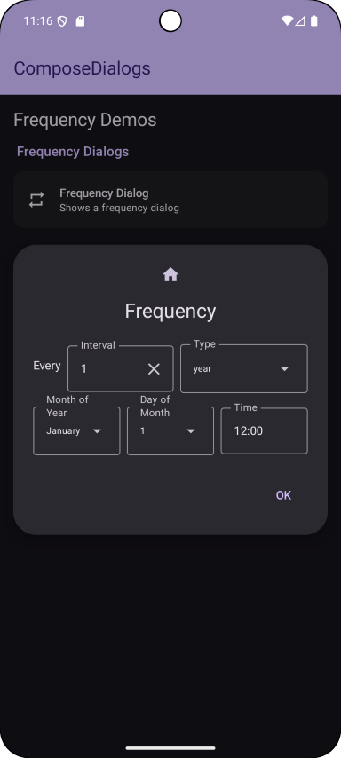

This shows a frequency selector dialog. It supports daily, weekly, monthly and yearly frequencies.

Check out the composable and it's documentation in the code snipplet below.

#### Example

```kotlin
--8<-- "../../demo/shared/src/commonMain/kotlin/com/michaelflisar/composedialogs/demo/demos/FrequencyDemos.kt:demo"
```

#### Composable

```kotlin
--8<-- "../../library/modules/frequency/src/commonMain/kotlin/com/michaelflisar/composedialogs/dialogs/frequency/DialogFrequency.kt:constructor"
```

#### Frequency class

This class offers some helpful functions to calculate the next date based on a given start date.

```kotlin
--8<-- "../../library/modules/frequency/src/commonMain/kotlin/com/michaelflisar/composedialogs/dialogs/frequency/classes/Frequency.kt:calcNextOccurrence"
```

```kotlin
--8<-- "../../library/modules/frequency/src/commonMain/kotlin/com/michaelflisar/composedialogs/dialogs/frequency/classes/Frequency.kt:calcNextOccurrences"
```

Here's a small example how to use it:

```kotlin
val time = LocalTime(12, 0)
val frequencyDaily1 = Frequency.Daily(time, 1)
val frequencyWeekly1 = Frequency.Weekly(DayOfWeek.MONDAY, time, 1)
val frequencyMonthly1 = Frequency.Monthly(31, time, 1)
val frequencyYearly1 = Frequency.Yearly(Month.JANUARY, 31, time, 1)

// Friday, January 31, 2025
val date = LocalDate(2025, Month.JANUARY, 31)

val nextDaily1 = frequencyDaily1.calcNextOccurrence(date) // February 1, 2025
val nextWeekly1 = frequencyWeekly1.calcNextOccurrence(date) // February 3 (next monday after date)
val nextMonthly1 = frequencyMonthly1.calcNextOccurrence(date) // March 31, 2025 (31st of next month)
val nextYearly1 = frequencyYearly1.calcNextOccurrence(date) // January 31, 2026 (31st of January next year)

// TIPP: do not use calcNextOccurrence recursively to get multiple occurrences, use calcNextOccurrence(..., offset = n) instead
// this avoid issues for example with monthly frequencies where the next month does not have the same day (e.g. 31st) and similar!

// you can also get multiple occurrences at once:
val next3Daily1 = frequencyDaily1.calcNextOccurrences(date, 3) // February 1, 2, 3 of 2025
val next3Weekly1 = frequencyWeekly1.calcNextOccurrences(date, 3) // February 3, 10, 17 of 2025
val next3Monthly1 = frequencyMonthly1.calcNextOccurrences(date, 3) // March 31, April 30, May 31 of 2025
val next3Yearly1 = frequencyYearly1.calcNextOccurrences(date, 3) // January 31 of 2026, 2027, 2028

// TIPP2: calcNextOccurrences does also support an offset parameter
```

#### Screenshots

|                                                             |                                                        |                                                             |                                                             |
|-------------------------------------------------------------|--------------------------------------------------------|-------------------------------------------------------------|-------------------------------------------------------------|
|  |  |  |  |