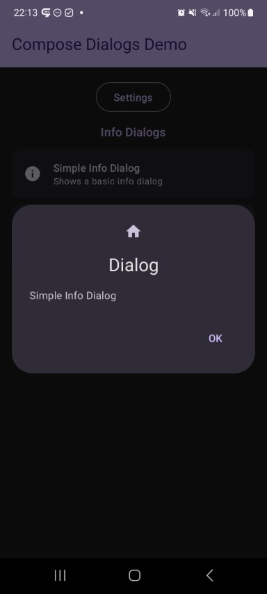
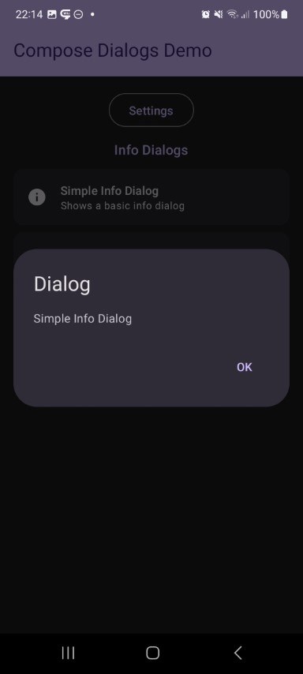
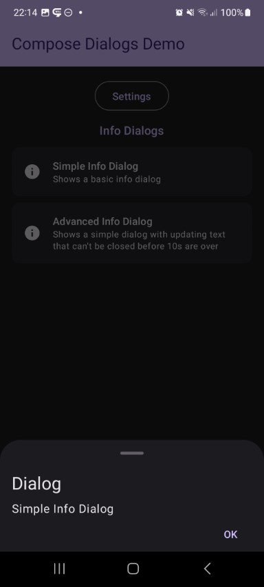
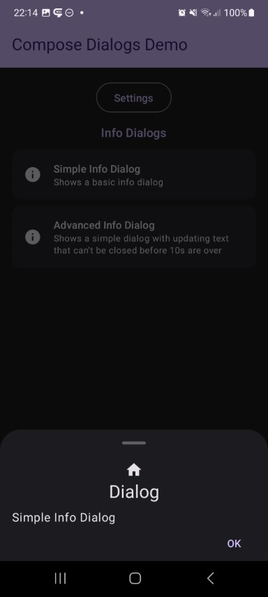

This shows a simple dialog with some informational text.

Check out the composable and it's documentation in the code snipplet below.

Generally following can be adjusted:

* an optional label for the information
  
#### Composable

```kotlin
--8<-- "../library/modules/info/src/commonMain/kotlin/com/michaelflisar/composedialogs/dialogs/info/DialogInfo.kt:13:37"
```

#### Example

```kotlin
--8<-- "../demo/android/src/main/java/com/michaelflisar/composedialogs/demo/demos/InfoDemos.kt:37:48"
```

#### Screenshots

| | | | |
|-|-|-|-|
|  |  |  |  |