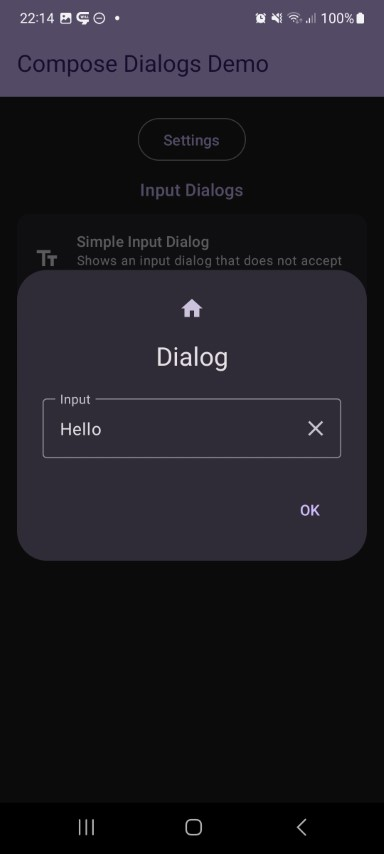

This shows a dialog with a `InputField`. All its parameters are exposed via the compose function as you can see below, which allows you to simply adjust the `InputFields` behaviour. Additinally you can attach a validator which ensures, that the dialog will only return a valid input and can't be closed otherwise.

Check out the composable and it's documentation in the code snipplet below.

Generally following can be adjusted:

* texts
* number of lines
* `TextField` options like number of lines, keyboard options, selection state...
* an optional `DialogInputValidator` can be provided

#### Composable

```kotlin
--8<-- "../library/modules/input/src/commonMain/kotlin/com/michaelflisar/composedialogs/dialogs/input/DialogInput.kt:24:77"
```

#### Example

```kotlin
--8<-- "../demo/android/src/main/java/com/michaelflisar/composedialogs/demo/demos/InputDemos.kt:57:90"
```

#### Screenshots

| | |
|-|-|
|  |  |