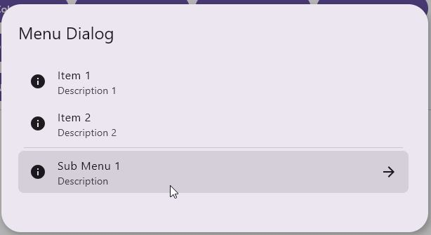

This shows a menu dialog that even supports unlimited nesting levels.

Check out the composable and it's documentation in the code snipplet below.

Generally following can be adjusted:

* menu items with optional icons
* unlimited level of nesting
* also supports divider items and custom items

#### Composable

```kotlin
--8<-- "../library/modules/menu/src/commonMain/kotlin/com/michaelflisar/composedialogs/dialogs/menu/DialogMenu.kt:30:51"
```

#### Example

```kotlin
--8<-- "../demo/desktop/src/jvmMain/kotlin/com/michaelflisar/composedialogs/demo/Main.kt:444:450"
```

Here's a full example of a menu that can be rendered:

```kotlin
--8<-- "../demo/desktop/src/jvmMain/kotlin/com/michaelflisar/composedialogs/demo/Main.kt:354:443"
```

#### Screenshots

| |
|-|
|  |