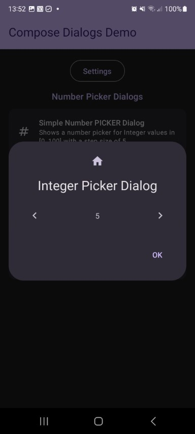

This shows a number **picker dialog**. You can always use the `InputDialog` for numbers as well and change its options to accept numbers only and even attach a validator. But this one is meant for picking numbers with the help of one or two increase and decrease buttons.

Check out the composable and it's documentation in the code snipplet below.

Generally following can be adjusted:

* min/max/step values
* custom formatter

#### Example

```kotlin
--8<-- "../../demo/shared/src/commonMain/kotlin/com/michaelflisar/composedialogs/demo/demos/NumberDemos.kt:demo"
```

#### Composable

```kotlin
--8<-- "../../library/modules/number/src/commonMain/kotlin/com/michaelflisar/composedialogs/dialogs/number/DialogNumberPicker.kt:constructor"
```

#### Screenshots

| | |                                                       |
|-|-|-------------------------------------------------------|
|  |  |  |