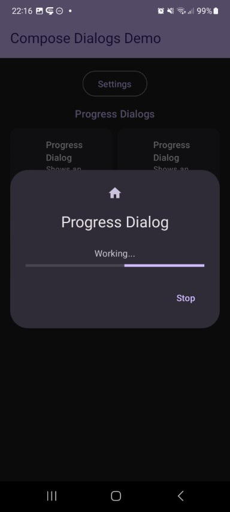

This shows a simple loading dialog with a progress indicator.

Check out the composable and it's documentation in the code snipplet below.

Generally following can be adjusted:

* circular or linear progress

#### Example

```kotlin
--8<-- "../demo/android/src/main/java/com/michaelflisar/composedialogs/demo/demos/ProgressDemos.kt:demo"
```

#### Composable

```kotlin
--8<-- "../library/modules/progress/src/commonMain/kotlin/com/michaelflisar/composedialogs/dialogs/progress/DialogProgress.kt:constructor"
```

#### Screenshots

| |                                                           |
|-|-----------------------------------------------------------|
|  |  |