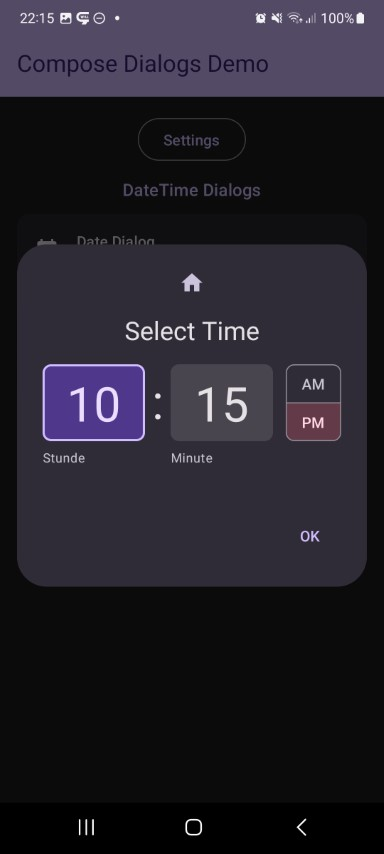
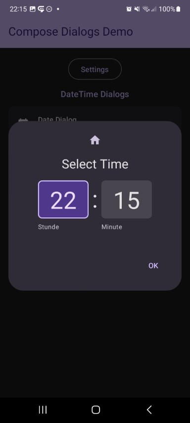

This shows a time selector dialog. 24h mode is optional.

Check out the composable and it's documentation in the code snipplet below.

Generally following can be adjusted:

* 12h/24h mode

#### Composable

```kotlin
--8<-- "../library/modules/time/src/commonMain/kotlin/com/michaelflisar/composedialogs/dialogs/time/DialogTime.kt:constructor"
```

#### Example

```kotlin
--8<-- "../demo/android/src/main/java/com/michaelflisar/composedialogs/demo/demos/DateTimeDemos.kt:demo-time"
```

#### Screenshots

| | |
|-|-|
|  |  |