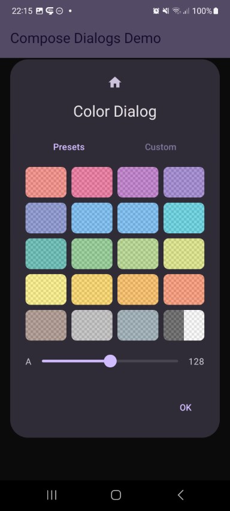

## Color Dialog

| Preview                                                   | | Module |
|:----------------------------------------------------------| :- | :- |
|  |  | `color` |

This shows a color selector dialog. A table with predefined material colors as well as a customisation page will be shown. Alpha support can be enabled optionally.

https://github.com/MFlisar/ComposeDialogs/blob/9e1739ddcf138f5774daf55c99c3f20af351be7b/library/modules/color/src/commonMain/kotlin/com/michaelflisar/composedialogs/dialogs/color/DialogColor.kt#L62-L81
