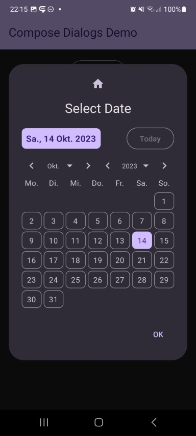
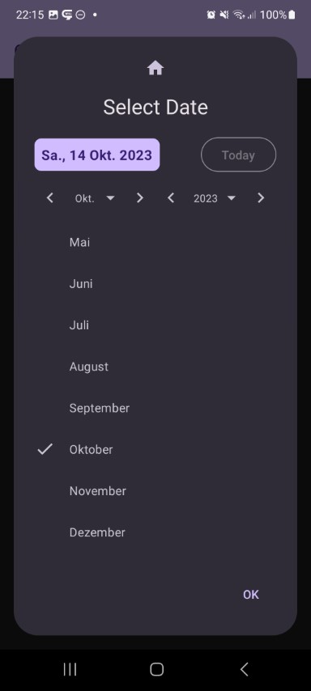

## Date Dialog

| Preview | | Module |
| :- | :- | :- |
|  |  | `date` |

This shows a date selector dialog. First day of week, labels, and style can be adjusted to your needs.

https://github.com/MFlisar/ComposeDialogs/blob/bb3a19df48614024b57c97ea88e18e38cfd9b41d/library/modules/date/src/commonMain/kotlin/com/michaelflisar/composedialogs/dialogs/date/DialogDate.kt#L71-L86
