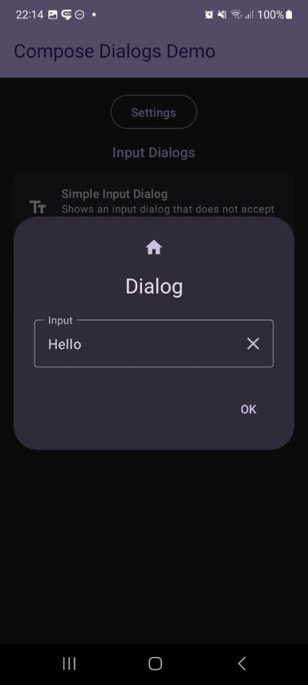

## Input Dialog

| Preview | | Module |
| :- | :- | :- |
|  |  | `input` |

This shows a dialog with a `InputField`. All its parameters are exposed via the compose function as you can see below, which allows you to simply adjust the `InputField`s behaviour. Additinally you can attach a validator which ensures, that the dialog will only return a valid input and can't be closed otherwise.

https://github.com/MFlisar/ComposeDialogs/blob/be44a5ac9ac4ad6c80bcbd0cd56ba38c6da66ce4/library/modules/input/src/commonMain/kotlin/com/michaelflisar/composedialogs/dialogs/input/DialogInput.kt#L50-L79

https://github.com/MFlisar/ComposeDialogs/blob/be44a5ac9ac4ad6c80bcbd0cd56ba38c6da66ce4/library/modules/input/src/commonMain/kotlin/com/michaelflisar/composedialogs/dialogs/input/DialogInputNumber.kt#L51-L79
