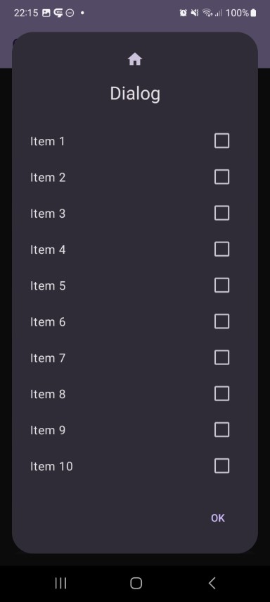
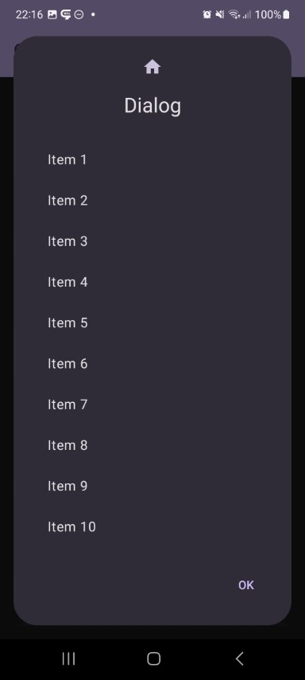

## List Dialog

| Preview | | Module |
| :- | :- | :- |
|  |  | `list` |
|  |  | `list` |

This shows a dialog with a list of items. Rendering, selection mode and more is adjustable.

Here you can create a dialog based on static list data like following:

```kotlin
fun <T> DialogList(
    state: DialogState,
    // Custom - Required
    items: List<T>,
    itemIdProvider: (item: T) -> Int,
    itemContents: DialogList.ItemContents<T>,
    selectionMode: DialogList.SelectionMode<T>,
    // Custom - Optional
    divider: Boolean = false,
    description: String = "",
    filter: DialogList.Filter<T>? = null,
    // Base Dialog - Optional
    title: String? = null,
    icon: (@Composable () -> Unit)? = null,
    style: ComposeDialogStyle = DialogDefaults.defaultDialogStyle(),
    buttons: DialogButtons = DialogDefaults.buttons(),
    options: Options = Options(),
    specialOptions: SpecialOptions = DialogDefaults.specialOptions(),
    onEvent: (event: DialogEvent) -> Unit = {}
)
```

But you can also create list with an asynchronous loader function like following:

```kotlin
fun <T> DialogList(
    state: DialogState,
    // Custom - Required
    itemsLoader: suspend () -> List<T>,
    itemIdProvider: (item: T) -> Int,
    itemContents: DialogList.ItemContents<T>,
    selectionMode: DialogList.SelectionMode<T>,
    // Custom - Optional
    itemSaver: Saver<MutableState<List<T>>, out Any>? = null,
    loadingIndicator: @Composable () -> Unit = {
        Box(modifier = Modifier.fillMaxWidth(), contentAlignment = Alignment.Center) {
            CircularProgressIndicator()
        }
    },
    divider: Boolean = false,
    description: String = "",
    filter: DialogList.Filter<T>? = null,
    // Base Dialog - Optional
    title: String? = null,
    icon: (@Composable () -> Unit)? = null,
    style: ComposeDialogStyle = DialogDefaults.defaultDialogStyle(),
    buttons: DialogButtons = DialogDefaults.buttons(),
    options: Options = Options(),
    specialOptions: SpecialOptions = DialogDefaults.specialOptions(),
    onEvent: (event: DialogEvent) -> Unit = {}
)
```