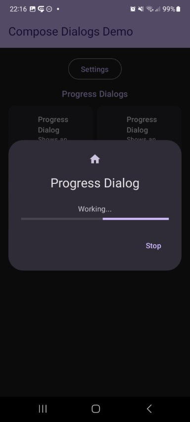
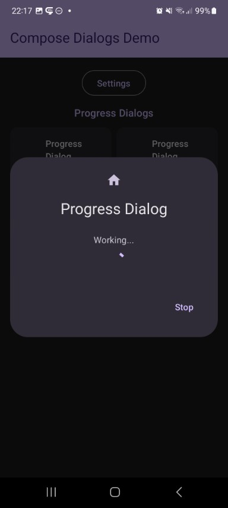

## Progress Dialog

| Preview | | Module |
| :- | :- | :- |
|  |  | `progress` |

This shows a simple loading dialog with a progress indicator.

https://github.com/MFlisar/ComposeDialogs/blob/6bd2af2338c5563060f50261534445e451e6db91/library/modules/progress/src/commonMain/kotlin/com/michaelflisar/composedialogs/dialogs/progress/DialogProgress.kt#L38-L53
